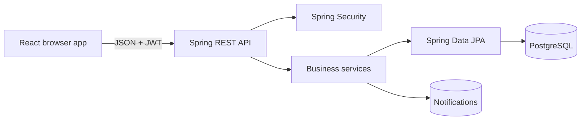

# Meals on Wheels Plus

Meals on Wheels Plus is a course-project MVP that coordinates meal deliveries and simulated robot companion services for seniors. Seniors submit and track requests, administrators approve/schedule/assign them, and volunteers complete only the work assigned to them.

## Features and roles

- **Senior:** sign in, edit contact/care profile, request meals and companion visits, track status, cancel eligible requests, view schedules and notifications.
- **Volunteer:** view only assigned deliveries and visits, see the minimum service information needed, advance valid statuses, and record completion notes.
- **Admin:** view summary counts, create/edit/activate/deactivate users, review and filter requests, approve/reject, schedule companion visits, and assign active volunteers.
- Backend-enforced JWT authentication, role and ownership checks, validated status transitions, BCrypt passwords, structured validation errors, and in-app notifications.

## Technology

- React 18, TypeScript, Vite
- Java 17, Spring Boot 3.3, Spring Security, Spring Data JPA
- PostgreSQL 16 (H2 is test-only)
- Docker Compose locally; multi-stage Docker/`heroku.yml` deployment

## Architecture



The backend is a modular monolith organized into controller, service, repository, domain, DTO, security, and configuration packages. The production Docker image serves the compiled React app and API from one Spring Boot process.

## Data model

- `users` has optional one-to-one `senior_profiles` or `volunteer_profiles`.
- `meal_requests` belongs to a senior and optionally references an assigned volunteer.
- `companion_requests` belongs to a senior and optionally references an assigned volunteer.
- `notifications` belongs to a user.
- All service/user references use database foreign keys. Emails and profile-to-user relationships are unique.

Status flows are deliberately constrained:

- Meal: `REQUESTED → APPROVED → ASSIGNED → PREPARING → OUT_FOR_DELIVERY → DELIVERED`
- Companion: `REQUESTED → APPROVED → SCHEDULED → ASSIGNED → IN_PROGRESS → COMPLETED`
- Admins may reject pending requests. Seniors may cancel meals before preparation and companion visits before they begin.

## Quick start (single Docker command)

Prerequisites: Docker Desktop with Compose.

```bash
docker compose up --build
```

Open <http://localhost:8080>. This starts PostgreSQL, builds both applications, creates the schema, and seeds local demo users. Stop without deleting data using `docker compose down`. Reset all local data using `docker compose down -v` (destructive).

## Development mode

1. Copy `.env.example` to `.env` if you want to customize defaults. Do not commit `.env`.
2. Start only PostgreSQL:

   ```bash
   docker compose up -d postgres
   ```

3. Start the backend:

   ```bash
   cd backend
   mvn spring-boot:run
   ```

4. In a second terminal, start the frontend:

   ```bash
   cd frontend
   npm ci
   npm run dev
   ```

5. Open <http://localhost:5173>. Vite proxies `/api` to port 8080.

On Windows PowerShell use `npm.cmd` if script execution policy blocks `npm.ps1`.

## Demo accounts

| Role | Email | Local password |
|---|---|---|
| Admin | `admin@mealsplus.local` | `Admin123!` |
| Senior | `senior@mealsplus.local` | `Senior123!` |
| Volunteer | `volunteer@mealsplus.local` | `Volunteer123!` |

These accounts are local demonstration data. Set `DEMO_SEED_ENABLED=false` in a real deployment, or override all `DEMO_*` credentials with secure config vars for a controlled demo deployment. Seeding is idempotent; resetting the Docker volume recreates the default records.

## Environment variables

| Variable | Purpose | Local default |
|---|---|---|
| `DB_URL` | JDBC PostgreSQL URL | `jdbc:postgresql://localhost:5432/mealsplus` |
| `DB_USERNAME` | PostgreSQL user | `mealsplus` |
| `DB_PASSWORD` | PostgreSQL password | `mealsplus` |
| `DATABASE_URL` | Heroku-style `postgres://` URL; takes precedence when present | unset |
| `JWT_SECRET` | JWT signing secret; use 32+ random bytes | development-only default |
| `JWT_EXPIRATION_MS` | Token lifetime | `86400000` |
| `PORT` | Backend HTTP port | `8080` |
| `CORS_ALLOWED_ORIGINS` | Comma-separated development frontend origins | `http://localhost:5173` |
| `DEMO_SEED_ENABLED` | Enable demo accounts | `true` |
| `DEMO_ADMIN_*`, `DEMO_SENIOR_*`, `DEMO_VOLUNTEER_*` | Optional demo credentials | documented accounts |

## API overview

All endpoints except login and health require `Authorization: Bearer <token>`.

| Area | Endpoints |
|---|---|
| Auth | `POST /api/auth/login`, `GET /api/auth/me` |
| Profile | `GET/PUT /api/profile`, `PUT /api/profile/senior`, `PUT /api/profile/volunteer` |
| Users (admin) | `GET/POST /api/users`, `PUT/DELETE /api/users/{id}` |
| Meals | `POST /api/meal-requests`, `GET /my`, `GET /assigned`, admin `GET /`, admin `PUT /{id}`, volunteer `PUT /{id}/status`, senior `DELETE /{id}` |
| Companions | Same structure under `/api/companion-requests` |
| Notifications | `GET /api/notifications`, `PUT /api/notifications/{id}/read` |
| Dashboard | `GET /api/dashboard` (admin) |
| Health | `GET /api/health` |

See [`api-requests.http`](api-requests.http) for executable request examples.

## Tests and builds

```bash
cd backend
mvn clean test
mvn package

cd ../frontend
npm ci
npm run build
```

Backend tests cover login, controller-level role authorization, token failure behavior, request creation, assignment ownership, cancellation ownership, scheduling requirements, and status transition validation. See [`MANUAL_TEST_CHECKLIST.md`](MANUAL_TEST_CHECKLIST.md) for the three end-to-end workflows.

## Heroku deployment

The repository uses a single multi-stage Docker image. The frontend is compiled into Spring Boot static resources, `PORT` is honored, and Heroku's automatically managed `DATABASE_URL` is parsed at startup.

```bash
heroku login
heroku create your-meals-plus-app --stack container
heroku addons:create heroku-postgresql -a your-meals-plus-app
heroku config:set JWT_SECRET="a-long-random-secret-at-least-32-bytes" DEMO_SEED_ENABLED=false -a your-meals-plus-app
git push heroku main
heroku open -a your-meals-plus-app
heroku logs --tail -a your-meals-plus-app
```

Alternatively, build locally with `heroku container:login`, `heroku container:push web -a APP`, then `heroku container:release web -a APP`. Do not copy a database URL into code: Heroku rotates credentials and updates `DATABASE_URL` automatically.

Use [`DEPLOYMENT_CHECKLIST.md`](DEPLOYMENT_CHECKLIST.md) before submission.

## Repository layout

```text
backend/                 Spring Boot API, security, persistence, tests
frontend/                React/Vite application
Dockerfile               Production multi-stage build
docker-compose.yml       Local app + PostgreSQL
heroku.yml / app.json    Heroku container metadata
api-requests.http        API smoke examples
MANUAL_TEST_CHECKLIST.md End-to-end verification steps
```

## Known limitations and future work

- Robot companion services are scheduling records only; there is no hardware integration.
- Schema evolution uses Hibernate `ddl-auto=update`, suitable for this MVP. A production successor should add Flyway migrations.
- Notifications update on page refresh rather than using WebSockets.
- There is no password reset, public registration, email/SMS, GPS tracking, route optimization, or pagination.
- A production deployment should add audit logs, rate limiting, stronger password policy, automated frontend tests, and database backups.
